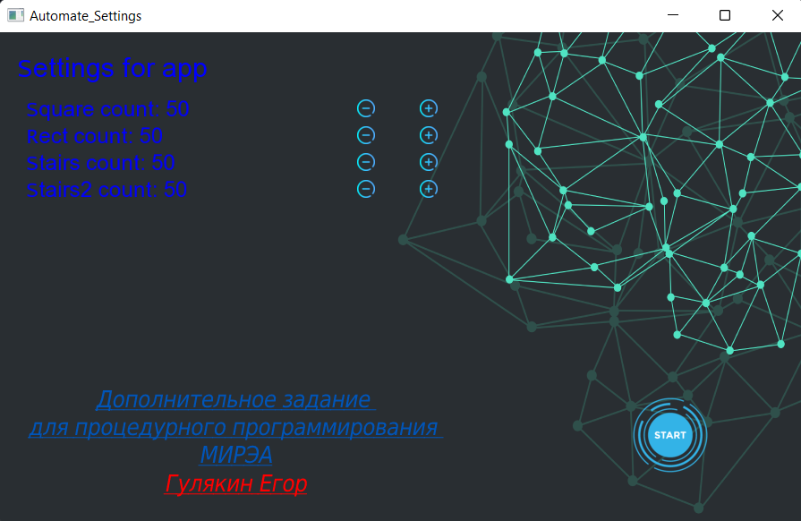
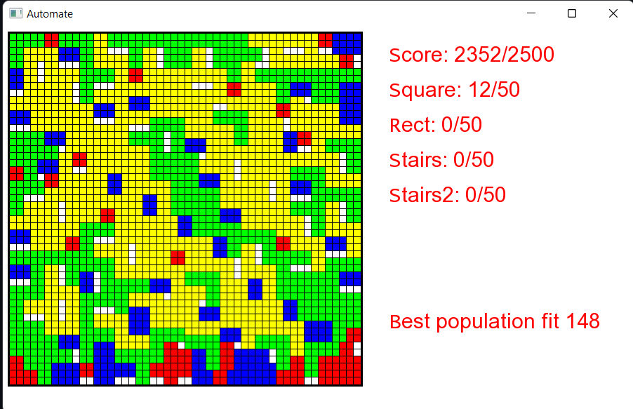

## Automaton application

https://ardyc.gitbook.io/procedure-codding/

My first application on cpp. <br>
Genetic algorithm. <br>
I created this program to get an automaton for procedural programming. <br>
The program is a search for the optimal placement of certain shapes on a 50x50 field.


## Configuration

In file values.h you can configure

```cpp
static const int POP_COUNT = 50;
static const int GEN_COUNT = 500;
static const int GEN_BEST_COUNT = 100;
static const int MUTATION_RATE = 100;
static const int MUTATION_BEST_RATE = 500;
```

## Screenshots




